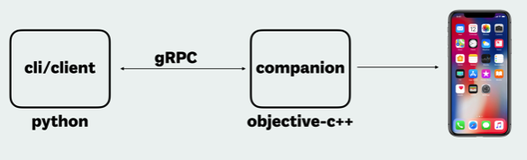

# 常见框架

移动端自动化测试常见框架：

* 多平台支持
  * Appium
    * 主页
      * GitHub
        * [appium/appium: Automation for iOS, Android, and Windows Apps.](https://github.com/appium/appium)
      * 官网
        * [Appium: Mobile App Automation Made Awesome.](http://appium.io)
    * 支持平台
      * iOS
      * Android
      * Windows
      * Mac
  * Airtest
    * 主页
      * GitHub
        * [AirtestProject/Airtest: UI Automation Framework for Games and Apps](https://github.com/AirtestProject/Airtest)
    * 支持平台
      * [Android](http://airtest.netease.com/docs/en/1_quick_start/2_test_with_Android_device.html)
      * [Emulator](https://github.com/AirtestProject/Airtest/blob/master/docs/wiki/platforms.md#android-emulator)
      * [iOS](https://github.com/AirtestProject/iOS-Tagent)
      * [Windows](http://airtest.netease.com/docs/en/1_quick_start/4_get_started_with_Windows_test.html)
      * [Unity](http://airtest.netease.com/docs/en/1_quick_start/1_how_to_write_the_first_script_for_your_game.html)
      * Cocos2dx
      * Egret
      * [WeChat](http://airtest.netease.com/blog/tutorial/WechatSmallProgram/)
* 单个平台
  * `Android`
    * `uiautomator2`=`u2`
  * `iOS`
    * `facebook-wda`
    * `idb`=`iOS Development Bridge`
      * 主页
        * GitHub
          * [facebook/idb: idb is a flexible command line interface for automating iOS simulators and devices](https://github.com/facebook/idb/)
        * 官网
          * [idb · iOS Development Bridge](https://www.fbidb.io)
      * Facebook新出的
      * 架构
        * 
      * 缺点：
        * 需要改动被测app的代码才能自动化测试？
          * 想要测试（iOS模拟器或真机）设备，要在被测设备中安装xctest测试用例才可以

> #### success:: u2和facebook-wda都是ATX拆分出来的
> 
> 最早是：
> 
> [NetEaseGame/ATX: Smart phone automation tool. Support iOS, Android, WebApp and game](https://github.com/NetEaseGame/ATX)
> 
> 后来拆分成：
> * `Android`的`uiautomator2`
> * `iOS`的`facebook-wda`

## iOS自动化测试框架发展历史

* iOS底层测试框架
  * iOS `8.0 ~ 9.3`：[UIAutomation](http://appium.io/docs/en/drivers/ios-uiautomation/index.html)
    * 缺点：只能调试单台设备
      * 原因：`instruments`限制单台Mac只能对应单台iOS设备
  * iOS `9.3+`: [XCUITest](http://appium.io/docs/en/drivers/ios-xcuitest/index.html)
    * 目的：用以替代旧的`UIAutomation`
* 第三方
  * `WebDriverAgent`
    * 作者：`Facebook`
    * 核心原理：实现了`WebDriver`的server
      * 通过 server 可以远程控制 iOS 设备
        * 支持各种操作：启动应用、关闭应用、点击、滚动等
        * 通过连接 XCTest.framework 调用苹果的 API 执行动作
    * 优点
      * 能够支持单台`Mac`对应多个iOS设备
        * 支持多个设备同时进行自动化
      * `Appium`、`Macaca`已经集成
