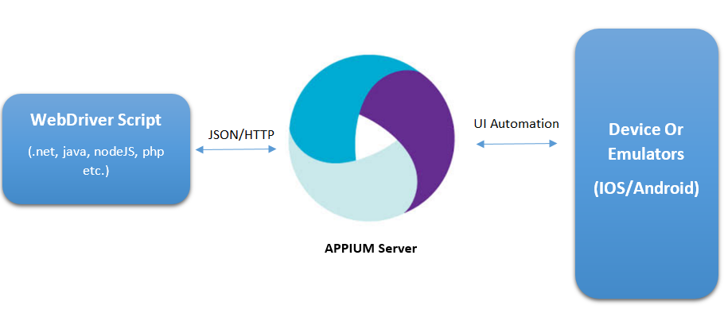
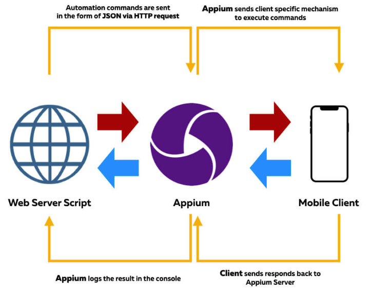
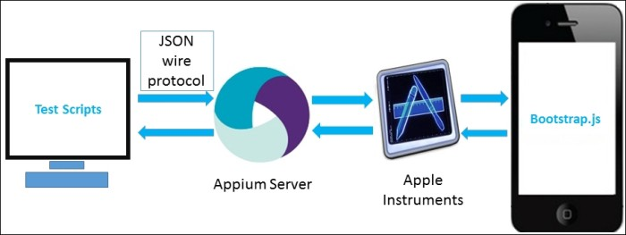

# Appium

移动端测试框架中，流行度最广的是：`Appium`

## Appium依赖于底层框架

* iOS
  * `Appium`在`iOS`>`9.3`后全面采用（底层基于`XCUITest`的）`WebDriverAgent`的方案
* `Android >= 4.3`: Google's [UiAutomator / UiAutomator2](https://developer.android.com/training/testing/ui-automator)
* `Windows`: Microsoft's [WinAppDriver](http://github.com/microsoft/winappdriver)

## Appium的iOS自动化架构

## 用Appium实现iOS自动化

对于iOS的真机，需要预先配置好才可以：

关于Appium的真机的设置：

* 官网 英文
  * [XCUITest Real Devices (iOS) - Appium](https://appium.io/docs/en/drivers/ios-xcuitest-real-devices/)
* readthedocs 中文
  * [Real devices ios - appium](https://appium.readthedocs.io/en/latest/cn/appium-setup/real-devices-ios/)
* GitHub
  * [appium-xcuitest-driver/real-device-config.md at master · appium/appium-xcuitest-driver](https://github.com/appium/appium-xcuitest-driver/blob/master/docs/real-device-config.md)

### iOS真机配置

